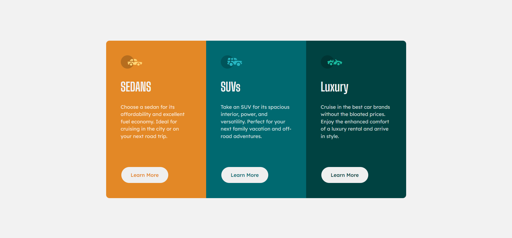

# Frontend Mentor - 3-column preview card component solution
This is a solution to the [3-column preview card component challenge on Frontend Mentor](https://www.frontendmentor.io/challenges/3column-preview-card-component-pH92eAR2-).

## Table of contents
- [Frontend Mentor - 3-column preview card component solution](#frontend-mentor---3-column-preview-card-component-solution)
  - [Table of contents](#table-of-contents)
    - [The challenge](#the-challenge)
    - [Screenshot](#screenshot)
    - [Links](#links)
    - [Built with](#built-with)
  - [Author](#author)

### The challenge
Users should be able to:
- View the optimal layout depending on their device's screen size
- See hover states for interactive elements

### Screenshot

### Links
- Solution URL: (https://github.com/M0hamedF/Column-preview-card)
- Live Site URL: (https://m0hamedf.github.io/Column-preview-card/)

### Built with
- Semantic HTML5
- CSS flex
- CSS Grid
- Mobile Responsive Design

## Author
- Frontend Mentor - [@M0hamedF](https://www.frontendmentor.io/profile/M0hamedF)